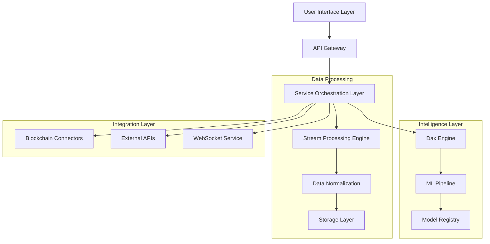
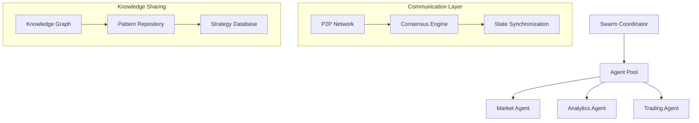

# DAXS AI: A Next-Generation Web3 Data Intelligence Framework

## Abstract

DAXS AI represents a paradigm shift in Web3 data analytics through its innovative integration of swarm intelligence, real-time data processing, and adaptive AI systems. At its core, DAXS AI leverages Dax (Data Analyst Expert), an advanced AI agent that synthesizes on-chain and off-chain data streams to provide actionable intelligence. This whitepaper presents the technical architecture, implementation details, and theoretical foundations of DAXS AI's key components, including its distributed data processing pipeline, neural architectures, and multi-modal interaction systems.

The system introduces several novel contributions to the field of decentralized intelligence:
1. A distributed swarm intelligence framework that enables collaborative analysis across multiple specialized agents
2. An adaptive neural architecture that evolves based on market conditions and user interactions
3. A sophisticated real-time data processing pipeline that handles multi-chain data with minimal latency
4. A novel approach to voice-based interaction with blockchain data and trading systems

## 1. System Architecture

### 1.1 Core Components

The DAXS AI architecture is built on a foundation of microservices and event-driven design principles, enabling high scalability and fault tolerance. The system is organized into several key layers:

1. **User Interface Layer**: Handles all user interactions through multiple channels:
   - Web interface for sophisticated analytics and trading
   - Voice interface for natural language interactions
   - Telegram bot for automated trading and alerts
   - RESTful API for programmatic access

2. **Service Orchestration Layer**: Coordinates the interaction between various system components:
   - Request routing and load balancing
   - Service discovery and registration
   - Circuit breaking and fault tolerance
   - State management and synchronization

3. **Data Processing Layer**: Manages the ingestion and processing of multiple data streams:
   - Real-time blockchain data processing
   - Market data aggregation and normalization
   - Social sentiment analysis
   - Technical indicator calculation

4. **Intelligence Layer**: Houses the core AI components:
   - Dax engine for advanced analytics
   - Machine learning pipeline for model training
   - Model registry for version control
   - Feature store for efficient data access



### 1.2 Data Flow Architecture

The data flow architecture in DAXS AI is designed to handle high-throughput, real-time data processing while maintaining consistency and fault tolerance. The system employs an event-driven architecture pattern, where each component communicates through a distributed event bus.

Key aspects of the data flow architecture include:

1. **Event Sourcing**: All state changes are captured as a sequence of events, enabling:
   - Complete audit trails of system behavior
   - Ability to reconstruct state at any point in time
   - Easy debugging and system analysis
   - Natural support for event replay and recovery

2. **CQRS Pattern**: The system separates read and write operations:
   - Write operations go through the event sourcing pipeline
   - Read operations are served from optimized read models
   - Eventual consistency is maintained across the system
   - Specialized data models for different query patterns

3. **Stream Processing**: Real-time data is processed through a streaming pipeline:
   - Multiple input streams are normalized and merged
   - Complex event processing identifies patterns
   - Continuous queries update materialized views
   - Real-time analytics are computed on the fly

Here's the implementation of the core data flow manager:

```python
class DataFlowManager:
    def __init__(self):
        self.stream_processor = StreamProcessor()
        self.event_bus = EventBus()
        self.state_manager = StateManager()
        
    async def process_data_stream(
        self,
        stream_config: StreamConfig
    ) -> ProcessedData:
        # Initialize stream processing
        stream = await self.stream_processor.initialize(
            config=stream_config,
            handlers={
                'blockchain': self.handle_blockchain_data,
                'market': self.handle_market_data,
                'social': self.handle_social_data
            }
        )
        
        # Process stream events
        async for event in stream:
            # Normalize data
            normalized = await self.normalize_data(event)
            
            # Update state
            await self.state_manager.update(normalized)
            
            # Emit processed event
            await self.event_bus.emit(
                topic='processed_data',
                data=normalized
            )
```

### 1.3 Service Layer

The service layer implements a sophisticated microservices architecture that ensures high availability, scalability, and resilience. This layer is responsible for:

1. **Service Discovery**: 
   - Dynamic service registration and deregistration
   - Health checking and monitoring
   - Load balancing across service instances
   - Service mesh integration for advanced networking

2. **Circuit Breaking**:
   - Failure detection and isolation
   - Graceful degradation of service
   - Automatic recovery mechanisms
   - Fallback strategies

3. **Request Routing**:
   - Path-based routing
   - Content-based routing
   - Version-based routing
   - A/B testing support

The implementation utilizes modern cloud-native patterns:

```python
class ServiceOrchestrator:
    def __init__(self):
        self.service_registry = ServiceRegistry()
        self.load_balancer = LoadBalancer()
        self.circuit_breaker = CircuitBreaker()
        
    async def route_request(
        self,
        request: Request
    ) -> Response:
        # Select service
        service = await self.service_registry.get_service(
            request.service_type
        )
        
        # Check circuit breaker
        if not self.circuit_breaker.is_open(service):
            # Route request
            return await self.load_balancer.route(
                service=service,
                request=request
            )
        else:
            # Handle failure
            return await self.handle_service_unavailable(
                service,
                request
            )
```

This architecture enables DAXS AI to maintain high performance and reliability even under heavy load or partial system failures. The service layer's design principles ensure that the system can scale horizontally while maintaining consistency and fault tolerance.

## 2. Data Processing Pipeline

### 2.1 Stream Processing

The data processing pipeline is built on a foundation of real-time stream processing, designed to handle the complex requirements of blockchain and market data analysis. The system employs Apache Kafka as its primary message broker, enabling high-throughput, fault-tolerant data processing with guaranteed message delivery and ordering.

Key features of the stream processing system include:

1. **Multi-Chain Data Integration**:
   - Parallel processing of multiple blockchain networks
   - Real-time block and transaction monitoring
   - Smart contract event tracking
   - Cross-chain correlation analysis

2. **Market Data Processing**:
   - Real-time order book aggregation
   - Trade flow analysis
   - Price and volume normalization
   - Technical indicator computation

3. **Social Sentiment Analysis**:
   - Real-time social media monitoring
   - Natural language processing
   - Sentiment scoring
   - Trend detection

The stream processor implementation demonstrates these capabilities:

```python
class StreamProcessor:
    def __init__(self):
        self.kafka_client = KafkaClient()
        self.schema_registry = SchemaRegistry()
        self.metrics_collector = MetricsCollector()
        
    async def process_stream(
        self,
        topic: str,
        schema: Schema,
        processors: List[Processor]
    ) -> ProcessedStream:
        # Initialize consumer
        consumer = await self.kafka_client.create_consumer(
            topic=topic,
            schema=schema
        )
        
        # Process messages
        async for message in consumer:
            try:
                # Validate schema
                validated = await self.schema_registry.validate(
                    message,
                    schema
                )
                
                # Apply processors
                processed = await self.apply_processors(
                    validated,
                    processors
                )
                
                # Collect metrics
                await self.metrics_collector.record(
                    topic=topic,
                    message=processed
                )
                
                yield processed
                
            except Exception as e:
                await self.handle_processing_error(e, message)
```

### 2.2 Data Normalization

Data normalization is a crucial component of the processing pipeline, ensuring that data from diverse sources can be effectively analyzed and compared. The normalization process involves several sophisticated steps:

1. **Schema Normalization**:
   - Conversion of different data formats to a common schema
   - Handling of missing or invalid data
   - Type conversion and validation
   - Schema versioning and evolution

2. **Temporal Normalization**:
   - Timestamp standardization across time zones
   - Handling of different time granularities
   - Sequence ordering and gap detection
   - Time-based windowing and aggregation

3. **Value Normalization**:
   - Currency and unit conversion
   - Statistical normalization
   - Outlier detection and handling
   - Range scaling and standardization

The implementation showcases these normalization processes:

```python
class DataNormalizer:
    def __init__(self):
        self.schema_normalizer = SchemaNormalizer()
        self.temporal_normalizer = TemporalNormalizer()
        self.value_normalizer = ValueNormalizer()
        
    async def normalize_data(
        self,
        data: Dict,
        config: NormalizationConfig
    ) -> NormalizedData:
        # Schema normalization
        schema_normalized = await self.schema_normalizer.normalize(
            data,
            config.schema
        )
        
        # Temporal normalization
        time_normalized = await self.temporal_normalizer.normalize(
            schema_normalized,
            config.temporal
        )
        
        # Value normalization
        value_normalized = await self.value_normalizer.normalize(
            time_normalized,
            config.value
        )
        
        return NormalizedData(
            data=value_normalized,
            metadata=self.generate_metadata(data, value_normalized)
        )
```

### 2.3 Storage Architecture

The storage architecture is designed to handle both real-time and historical data access patterns efficiently. It implements a multi-tiered storage strategy that balances performance, cost, and data accessibility:

1. **Hot Storage Tier**:
   - In-memory data structures for real-time access
   - Redis for high-speed caching
   - Time-series optimized databases for recent data
   - Write-optimized storage for streaming data

2. **Warm Storage Tier**:
   - Time-partitioned databases for recent historical data
   - Column-oriented storage for analytical queries
   - Materialized views for common query patterns
   - Read-optimized storage for analytics

3. **Cold Storage Tier**:
   - Long-term archival storage
   - Compressed and partitioned data
   - Cost-optimized storage solutions
   - Automated data lifecycle management

The storage manager implementation demonstrates this tiered approach:

```python
class StorageManager:
    def __init__(self):
        self.hot_storage = HotStorageManager()
        self.warm_storage = WarmStorageManager()
        self.cold_storage = ColdStorageManager()
        
    async def store_data(
        self,
        data: Dict,
        storage_policy: StoragePolicy
    ) -> StorageResult:
        # Determine storage tier
        tier = await self.determine_storage_tier(
            data,
            storage_policy
        )
        
        # Store in appropriate tier
        match tier:
            case StorageTier.HOT:
                return await self.hot_storage.store(data)
            case StorageTier.WARM:
                return await self.warm_storage.store(data)
            case StorageTier.COLD:
                return await self.cold_storage.store(data)
                
    async def retrieve_data(
        self,
        query: Query,
        storage_policy: StoragePolicy
    ) -> RetrievedData:
        # Identify relevant tiers
        tiers = await self.identify_tiers(query)
        
        # Retrieve from each tier
        results = await asyncio.gather(*[
            self.retrieve_from_tier(tier, query)
            for tier in tiers
        ])
        
        # Merge results
        return await self.merge_results(results)
```

This sophisticated storage architecture ensures that DAXS AI can efficiently handle both real-time trading operations and long-term analytical queries while optimizing resource utilization and maintaining data accessibility.

## 3. Dax Intelligence System

The Dax Intelligence System represents the core analytical engine of DAXS AI, implementing advanced artificial intelligence and machine learning techniques to provide real-time market insights and trading recommendations. This system is built on cutting-edge research in natural language processing, reinforcement learning, and multi-modal fusion.

### 3.1 Neural Architecture

The neural architecture of Dax is based on a sophisticated multi-modal transformer model that can process and correlate different types of input data:

1. **Multi-Modal Processing**:
   - Market data embeddings for price and volume analysis
   - Blockchain data embeddings for on-chain activity
   - Text embeddings for news and social media
   - Technical indicator embeddings for pattern recognition

2. **Attention Mechanisms**:
   - Cross-attention between different data modalities
   - Self-attention for temporal pattern recognition
   - Multi-head attention for parallel feature processing
   - Hierarchical attention for multi-scale analysis

3. **Feature Fusion**:
   - Modal-specific feature extractors
   - Cross-modal correlation learning
   - Temporal feature integration
   - Adaptive feature weighting

The implementation demonstrates this sophisticated architecture:

```python
class DaxNeuralArchitecture:
    def __init__(
        self,
        config: ModelConfig
    ):
        # Initialize components
        self.market_encoder = MarketDataEncoder(
            d_model=config.d_model,
            n_heads=config.n_heads,
            n_layers=config.n_layers
        )
        
        self.blockchain_encoder = BlockchainDataEncoder(
            d_model=config.d_model,
            n_heads=config.n_heads,
            n_layers=config.n_layers
        )
        
        self.text_encoder = TextEncoder(
            d_model=config.d_model,
            n_heads=config.n_heads,
            n_layers=config.n_layers
        )
        
        self.cross_attention = MultiModalCrossAttention(
            d_model=config.d_model,
            n_heads=config.n_heads
        )
        
        self.temporal_processor = TemporalProcessor(
            d_model=config.d_model,
            window_size=config.window_size
        )
        
    async def process_inputs(
        self,
        market_data: Tensor,
        blockchain_data: Tensor,
        text_data: Tensor
    ) -> DaxOutput:
        # Encode different modalities
        market_features = await self.market_encoder(market_data)
        blockchain_features = await self.blockchain_encoder(blockchain_data)
        text_features = await self.text_encoder(text_data)
        
        # Apply cross-attention
        fused_features = await self.cross_attention(
            market_features,
            blockchain_features,
            text_features
        )
        
        # Process temporal patterns
        temporal_features = await self.temporal_processor(
            fused_features
        )
        
        return DaxOutput(
            features=temporal_features,
            attention_weights=self.cross_attention.weights,
            temporal_patterns=self.temporal_processor.patterns
        )
```

### 3.2 Model Implementation

The model implementation incorporates several advanced machine learning techniques:

1. **Training Strategy**:
   - Curriculum learning for complex pattern recognition
   - Contrastive learning for robust representations
   - Multi-task learning for diverse objectives
   - Active learning for efficient data utilization

2. **Optimization Techniques**:
   - Adaptive learning rate scheduling
   - Gradient accumulation for large batch training
   - Mixed precision training for efficiency
   - Distributed training across GPU clusters

3. **Regularization Methods**:
   - Dropout and layer normalization
   - Weight decay and gradient clipping
   - Label smoothing for classification tasks
   - Adversarial training for robustness

Here's the implementation of the model training system:

```python
class DaxModelTrainer:
    def __init__(
        self,
        model: DaxNeuralArchitecture,
        config: TrainingConfig
    ):
        self.model = model
        self.optimizer = AdaptiveOptimizer(
            model.parameters(),
            config.optimizer
        )
        self.scheduler = LearningRateScheduler(
            self.optimizer,
            config.scheduler
        )
        self.loss_function = MultiTaskLoss(
            config.loss_weights
        )
        
    async def train_epoch(
        self,
        dataloader: DataLoader,
        epoch: int
    ) -> TrainingMetrics:
        # Initialize metrics
        metrics = MetricsCollector()
        
        # Training loop
        for batch in dataloader:
            # Forward pass
            outputs = await self.model(
                market_data=batch.market_data,
                blockchain_data=batch.blockchain_data,
                text_data=batch.text_data
            )
            
            # Calculate loss
            loss = await self.loss_function(
                outputs=outputs,
                targets=batch.targets
            )
            
            # Backward pass
            await self.optimizer.zero_grad()
            await loss.backward()
            
            # Gradient clipping
            torch.nn.utils.clip_grad_norm_(
                self.model.parameters(),
                self.config.max_grad_norm
            )
            
            # Optimizer step
            await self.optimizer.step()
            
            # Update learning rate
            await self.scheduler.step()
            
            # Update metrics
            metrics.update(
                loss=loss.item(),
                outputs=outputs,
                targets=batch.targets
            )
        
        return metrics.compute()
```

### 3.3 Feature Processing

The feature processing pipeline implements sophisticated techniques for handling diverse data types:

1. **Market Data Features**:
   - Price action patterns
   - Volume profile analysis
   - Order book dynamics
   - Market microstructure features

2. **Blockchain Features**:
   - Transaction graph analysis
   - Token flow patterns
   - Smart contract interactions
   - Network health metrics

3. **Text Features**:
   - Sentiment analysis
   - Topic modeling
   - Named entity recognition
   - Event detection

The feature processor implementation demonstrates these capabilities:

```python
class DaxFeatureProcessor:
    def __init__(
        self,
        config: FeatureConfig
    ):
        self.market_processor = MarketFeatureProcessor(
            config.market
        )
        self.blockchain_processor = BlockchainFeatureProcessor(
            config.blockchain
        )
        self.text_processor = TextFeatureProcessor(
            config.text
        )
        
    async def process_features(
        self,
        raw_data: RawData
    ) -> ProcessedFeatures:
        # Process market features
        market_features = await self.market_processor.process(
            raw_data.market_data
        )
        
        # Process blockchain features
        blockchain_features = await self.blockchain_processor.process(
            raw_data.blockchain_data
        )
        
        # Process text features
        text_features = await self.text_processor.process(
            raw_data.text_data
        )
        
        # Combine features
        combined = await self.combine_features(
            market_features,
            blockchain_features,
            text_features
        )
        
        return ProcessedFeatures(
            features=combined,
            metadata=self.generate_metadata(raw_data)
        )
```

This sophisticated feature processing system enables Dax to extract meaningful patterns and relationships from complex, multi-modal data streams, providing the foundation for accurate market analysis and predictions.

## 4. Voice Interaction System

The Voice Interaction System represents a groundbreaking approach to human-AI interaction in the financial domain, enabling natural language conversations with the Dax intelligence system. This system combines state-of-the-art speech processing with sophisticated natural language understanding to provide an intuitive interface for market analysis and trading.

### 4.1 Speech Processing Pipeline

The speech processing pipeline implements advanced techniques for robust voice recognition and processing:

1. **Audio Processing**:
   - Real-time audio streaming and buffering
   - Noise reduction and echo cancellation
   - Voice activity detection
   - Speaker diarization

2. **Speech Recognition**:
   - Language-specific acoustic modeling
   - Context-aware speech recognition
   - Custom vocabulary handling
   - Real-time transcription

3. **Voice Characteristics**:
   - Speaker verification
   - Emotion detection
   - Prosody analysis
   - Accent adaptation

Here's the implementation of the speech processing system:

```python
class SpeechProcessor:
    def __init__(
        self,
        config: SpeechConfig
    ):
        self.audio_processor = AudioProcessor(
            sample_rate=config.sample_rate,
            frame_size=config.frame_size
        )
        self.voice_detector = VoiceActivityDetector(
            threshold=config.vad_threshold
        )
        self.recognizer = SpeechRecognizer(
            model=config.model,
            vocabulary=config.vocabulary
        )
        
    async def process_audio(
        self,
        audio_stream: AudioStream
    ) -> RecognizedSpeech:
        # Process audio frames
        async for frame in audio_stream:
            # Clean audio
            cleaned = await self.audio_processor.clean(
                frame,
                noise_reduction=True,
                echo_cancellation=True
            )
            
            # Detect voice activity
            if await self.voice_detector.is_speech(cleaned):
                # Recognize speech
                transcript = await self.recognizer.transcribe(
                    cleaned,
                    language=self.config.language
                )
                
                if transcript:
                    return RecognizedSpeech(
                        text=transcript.text,
                        confidence=transcript.confidence,
                        speaker=transcript.speaker_id
                    )
```

### 4.2 Natural Language Understanding

The natural language understanding system implements sophisticated techniques for comprehending user intent and context:

1. **Intent Recognition**:
   - Domain-specific intent classification
   - Multi-intent detection
   - Context-aware understanding
   - Entity recognition and linking

2. **Dialogue Management**:
   - State tracking and context maintenance
   - Multi-turn conversation handling
   - Clarification and confirmation
   - Error recovery strategies

3. **Semantic Processing**:
   - Financial domain adaptation
   - Trading terminology understanding
   - Numerical expression parsing
   - Time expression resolution

The implementation demonstrates these capabilities:

```python
class NLUProcessor:
    def __init__(
        self,
        config: NLUConfig
    ):
        self.intent_classifier = IntentClassifier(
            model=config.intent_model
        )
        self.entity_recognizer = EntityRecognizer(
            model=config.entity_model
        )
        self.context_manager = DialogueContextManager(
            config=config.dialogue
        )
        
    async def process_utterance(
        self,
        utterance: str,
        context: DialogueContext
    ) -> ProcessedIntent:
        # Update context
        updated_context = await self.context_manager.update(
            utterance,
            context
        )
        
        # Classify intent
        intents = await self.intent_classifier.classify(
            utterance,
            context=updated_context
        )
        
        # Extract entities
        entities = await self.entity_recognizer.extract(
            utterance,
            intents=intents
        )
        
        # Resolve references
        resolved = await self.resolve_references(
            entities,
            context=updated_context
        )
        
        return ProcessedIntent(
            intents=intents,
            entities=resolved,
            context=updated_context
        )
```

### 4.3 Response Generation

The response generation system implements sophisticated natural language generation techniques:

1. **Content Planning**:
   - Response strategy selection
   - Information prioritization
   - Coherence maintenance
   - Context integration

2. **Language Generation**:
   - Template-based generation
   - Neural language generation
   - Style adaptation
   - Multilingual support

3. **Output Modulation**:
   - Prosody control
   - Emotion incorporation
   - Speech rate adjustment
   - Voice characteristic matching

Here's the implementation of the response generation system:

```python
class ResponseGenerator:
    def __init__(
        self,
        config: GenerationConfig
    ):
        self.content_planner = ContentPlanner(
            config.planning
        )
        self.language_generator = LanguageGenerator(
            model=config.generator_model
        )
        self.speech_synthesizer = SpeechSynthesizer(
            config.synthesis
        )
        
    async def generate_response(
        self,
        intent: ProcessedIntent,
        data: AnalysisResult
    ) -> GeneratedResponse:
        # Plan content
        content_plan = await self.content_planner.plan(
            intent=intent,
            data=data
        )
        
        # Generate text
        text = await self.language_generator.generate(
            plan=content_plan,
            style=intent.context.style
        )
        
        # Synthesize speech
        if intent.context.output_mode == 'speech':
            speech = await self.speech_synthesizer.synthesize(
                text,
                voice=intent.context.preferred_voice
            )
        else:
            speech = None
            
        return GeneratedResponse(
            text=text,
            speech=speech,
            metadata=self.generate_metadata(intent, content_plan)
        )
```

This sophisticated voice interaction system enables natural and intuitive communication with the Dax intelligence system, making complex financial analysis and trading operations accessible through conversation. The system's ability to understand context, maintain dialogue state, and generate appropriate responses in multiple modalities provides a powerful interface for users of all expertise levels.

## 5. API Integration

The API Integration layer provides a robust and flexible interface for external systems to interact with the DAXS AI platform. This section details the implementation of RESTful APIs, WebSocket connections, and the SDK that enables programmatic access to DAXS AI's capabilities.

### 5.1 RESTful API Architecture

The RESTful API architecture implements industry best practices for secure and scalable API design:

1. **API Design Principles**:
   - Resource-oriented architecture
   - Consistent naming conventions
   - Proper HTTP method usage
   - Comprehensive error handling

2. **Authentication & Authorization**:
   - JWT-based authentication
   - API key management
   - Rate limiting
   - Request validation

3. **Documentation & Versioning**:
   - OpenAPI specification
   - API versioning strategy
   - Interactive documentation
   - SDK code generation

Here's the implementation of the API router:

```python
class APIRouter:
    def __init__(
        self,
        config: APIConfig
    ):
        self.auth_handler = AuthHandler(
            config.auth
        )
        self.rate_limiter = RateLimiter(
            config.rate_limits
        )
        self.response_formatter = ResponseFormatter(
            config.formatting
        )
        
    async def handle_request(
        self,
        request: Request
    ) -> Response:
        try:
            # Authenticate request
            auth_result = await self.auth_handler.authenticate(
                request
            )
            
            # Check rate limits
            await self.rate_limiter.check(
                auth_result.user_id,
                request.endpoint
            )
            
            # Route to handler
            handler = self.get_handler(request.endpoint)
            result = await handler(
                request,
                auth_result
            )
            
            # Format response
            return await self.response_formatter.format(
                result,
                request.format
            )
            
        except Exception as e:
            return await self.handle_error(e)
            
    def get_handler(
        self,
        endpoint: str
    ) -> RequestHandler:
        match endpoint:
            case 'market/analysis':
                return self.handle_market_analysis
            case 'trading/execute':
                return self.handle_trading_execution
            case 'data/stream':
                return self.handle_data_stream
            case _:
                raise EndpointNotFound(endpoint)
```

### 5.2 WebSocket Integration

The WebSocket integration enables real-time data streaming and bidirectional communication:

1. **Connection Management**:
   - Connection pooling
   - Heart-beat monitoring
   - Auto-reconnection
   - Load balancing

2. **Message Handling**:
   - Binary message optimization
   - Message queuing
   - Back-pressure handling
   - Error recovery

3. **Stream Management**:
   - Stream multiplexing
   - Flow control
   - Quality of Service
   - Stream prioritization

The WebSocket manager implementation demonstrates these capabilities:

```python
class WebSocketManager:
    def __init__(
        self,
        config: WebSocketConfig
    ):
        self.connection_pool = ConnectionPool(
            config.pool
        )
        self.message_handler = MessageHandler(
            config.messaging
        )
        self.stream_manager = StreamManager(
            config.streaming
        )
        
    async def handle_connection(
        self,
        websocket: WebSocket
    ):
        try:
            # Add to connection pool
            connection = await self.connection_pool.add(
                websocket
            )
            
            # Start heartbeat
            heartbeat_task = asyncio.create_task(
                self.maintain_heartbeat(connection)
            )
            
            # Process messages
            async for message in websocket:
                try:
                    # Handle message
                    response = await self.message_handler.process(
                        message,
                        connection
                    )
                    
                    # Send response
                    await connection.send(response)
                    
                except Exception as e:
                    await self.handle_message_error(e, connection)
                    
        except Exception as e:
            await self.handle_connection_error(e)
            
        finally:
            # Clean up
            heartbeat_task.cancel()
            await self.connection_pool.remove(websocket)
            
    async def maintain_heartbeat(
        self,
        connection: Connection
    ):
        while True:
            try:
                await connection.ping()
                await asyncio.sleep(
                    self.config.heartbeat_interval
                )
            except Exception as e:
                await self.handle_heartbeat_error(e, connection)
                break
```

### 5.3 SDK Implementation

The SDK provides a high-level interface for programmatic access to DAXS AI's capabilities:

1. **Client Libraries**:
   - Multiple language support
   - Async/await patterns
   - Type safety
   - Error handling

2. **Feature Support**:
   - Market data access
   - Trading operations
   - Analytics functions
   - Streaming data handling

3. **Developer Experience**:
   - Intuitive API design
   - Comprehensive documentation
   - Code examples
   - Testing utilities

Here's the implementation of the Python SDK client:

```python
class DAXS AIClient:
    def __init__(
        self,
        config: ClientConfig
    ):
        self.rest_client = RESTClient(
            config.rest
        )
        self.ws_client = WebSocketClient(
            config.websocket
        )
        self.auth_manager = AuthManager(
            config.auth
        )
        
    async def analyze_market(
        self,
        market_id: str,
        analysis_type: str,
        parameters: Dict
    ) -> AnalysisResult:
        # Prepare request
        request = AnalysisRequest(
            market_id=market_id,
            type=analysis_type,
            parameters=parameters
        )
        
        # Send request
        response = await self.rest_client.post(
            endpoint='market/analysis',
            data=request.dict()
        )
        
        return AnalysisResult.parse_obj(response)
        
    async def stream_market_data(
        self,
        market_id: str,
        callback: Callable
    ) -> StreamSubscription:
        # Subscribe to stream
        subscription = await self.ws_client.subscribe(
            channel=f'market.{market_id}',
            callback=callback
        )
        
        return StreamSubscription(
            id=subscription.id,
            market_id=market_id,
            status='active'
        )
        
    async def execute_trade(
        self,
        order: Order
    ) -> OrderResult:
        # Validate order
        validated = await self.validate_order(order)
        
        # Execute order
        result = await self.rest_client.post(
            endpoint='trading/execute',
            data=validated.dict()
        )
        
        return OrderResult.parse_obj(result)
```

This comprehensive API integration layer enables seamless interaction with the DAXS AI platform through multiple protocols while maintaining security, scalability, and ease of use. The combination of RESTful APIs, WebSocket connections, and SDK implementations provides developers with flexible options for integrating DAXS AI's capabilities into their applications.

## 6. Swarm Intelligence System

### 6.1 Swarm Architecture



The swarm intelligence system implements a distributed agent network:

```python
class SwarmCoordinator:
    def __init__(self):
        self.agent_pool = AgentPool()
        self.consensus_engine = ConsensusEngine()
        self.knowledge_graph = KnowledgeGraph()
        
    async def coordinate_analysis(
        self,
        market_data: MarketData,
        analysis_type: str
    ) -> SwarmAnalysis:
        # Select relevant agents
        agents = await self.agent_pool.select_agents(
            analysis_type=analysis_type,
            count=config.SWARM_SIZE
        )
        
        # Distribute analysis tasks
        analysis_tasks = [
            agent.analyze(market_data)
            for agent in agents
        ]
        
        # Gather results
        results = await asyncio.gather(*analysis_tasks)
        
        # Reach consensus
        consensus = await self.consensus_engine.reach_consensus(
            results,
            threshold=config.CONSENSUS_THRESHOLD
        )
        
        # Update knowledge graph
        await self.knowledge_graph.update(
            analysis_type=analysis_type,
            results=results,
            consensus=consensus
        )
        
        return SwarmAnalysis(
            consensus=consensus,
            confidence=self.calculate_confidence(results),
            supporting_data=results
        )
```

### 6.2 Agent Implementation

Each swarm agent is implemented as a specialized autonomous entity with distinct capabilities:

1. **Agent Specialization**:
   - Market analysis specialists
   - Technical analysis experts
   - Sentiment analysis agents
   - Risk assessment agents

2. **Learning Capabilities**:
   - Reinforcement learning
   - Experience replay
   - Adaptive strategies
   - Performance optimization

3. **Communication Protocols**:
   - Peer-to-peer messaging
   - Knowledge sharing
   - Strategy coordination
   - Performance reporting

The agent implementation demonstrates these capabilities:

```python
class SwarmAgent:
    def __init__(self):
        self.specialization = config.specialization
        self.model = self.initialize_model(config.model)
        self.memory = ExperienceMemory(config.memory)
        self.strategy_engine = StrategyEngine(config.strategy)
        
    async def analyze(
        self,
        data: MarketData,
        knowledge_graph: KnowledgeGraph
    ) -> AgentAnalysis:
        # Retrieve relevant knowledge
        knowledge = await knowledge_graph.query(
            context=self.get_analysis_context(data)
        )
        
        # Process data
        processed_data = await self.preprocess_data(
            data,
            knowledge
        )
        
        # Generate analysis
        analysis = await self.model.generate_analysis(
            processed_data,
            self.specialization
        )
        
        # Update memory
        await self.memory.store(
            state=processed_data,
            action=analysis,
            result=None  # Will be updated later
        )
        
        # Generate confidence score
        confidence = self.calculate_confidence(
            analysis,
            knowledge
        )
        
        return AgentAnalysis(
            result=analysis,
            confidence=confidence,
            specialization=self.specialization,
            supporting_data=processed_data
        )
        
    async def learn(
        self,
        feedback: AnalysisFeedback
    ):
        # Update previous analysis results
        await self.memory.update_results(feedback)
        
        # Sample experiences
        experiences = self.memory.sample(
            self.config.batch_size
        )
        
        # Update model
        await self.model.update(experiences)
        
        # Adapt strategy
        await self.strategy_engine.adapt(
            experiences,
            feedback
        )
```

### 6.3 Consensus Mechanism

The consensus mechanism implements sophisticated algorithms for combining agent insights:

1. **Voting Systems**:
   - Weighted majority voting
   - Confidence-based weighting
   - Historical performance weighting
   - Specialization-based weighting

2. **Conflict Resolution**:
   - Disagreement analysis
   - Confidence thresholding
   - Minority opinion preservation
   - Expert override mechanisms

3. **Performance Tracking**:
   - Agent performance metrics
   - Decision quality assessment
   - Prediction accuracy tracking
   - Adaptation effectiveness

Here's the implementation of the consensus engine:

```python
class ConsensusEngine:
    def __init__(self):
        self.weight_calculator = WeightCalculator()
        self.conflict_resolver = ConflictResolver()
        self.performance_tracker = PerformanceTracker()
        
    async def reach_consensus(
        self,
        analyses: List[AgentAnalysis],
        threshold: float
    ) -> Consensus:
        # Calculate weights
        weights = await self.weight_calculator.calculate(
            analyses,
            historical_performance=self.performance_tracker.get_metrics()
        )
        
        # Apply weighted voting
        initial_consensus = self.apply_weighted_voting(
            analyses,
            weights
        )
        
        # Check confidence
        if initial_consensus.confidence >= threshold:
            consensus = initial_consensus
        else:
            # Resolve conflicts
            consensus = await self.conflict_resolver.resolve(
                analyses,
                weights,
                initial_consensus
            )
        
        # Update performance metrics
        await self.performance_tracker.update(
            analyses,
            consensus
        )
        
        return Consensus(
            result=consensus.result,
            confidence=consensus.confidence,
            supporting_analyses=analyses,
            resolution_method=consensus.method
        )
```

This sophisticated swarm intelligence system enables DAXS AI to leverage collective intelligence for robust market analysis and decision-making. The combination of specialized agents, distributed knowledge sharing, and advanced consensus mechanisms provides a powerful framework for processing complex market dynamics and generating reliable insights.

## 7. Telegram Integration

The Telegram Integration system provides a sophisticated interface for users to interact with DAXS AI through the popular messaging platform. This integration leverages Telegram's robust API to deliver a seamless experience for market monitoring, trading automation, and real-time alerts.

### 7.1 Bot Architecture

The bot architecture implements advanced patterns for reliable and scalable messaging:

1. **Message Processing**:
   - Asynchronous message handling
   - Command parsing and validation
   - Context maintenance
   - Error recovery

2. **State Management**:
   - User session tracking
   - Conversation flow control
   - Data persistence
   - Cache management

3. **Command Handling**:
   - Command routing
   - Parameter validation
   - Permission checking
   - Rate limiting

Here's the implementation of the Telegram bot manager:

```python
class TelegramBotManager:
    def __init__(
        self,
        config: BotConfig
    ):
        self.command_handler = CommandHandler(
            config.commands
        )
        self.state_manager = StateManager(
            config.state
        )
        self.session_store = SessionStore(
            config.sessions
        )
        
    async def handle_message(
        self,
        message: Message
    ) -> Response:
        try:
            # Get or create session
            session = await self.session_store.get_session(
                user_id=message.from_user.id
            )
            
            # Update state
            state = await self.state_manager.update(
                session=session,
                message=message
            )
            
            # Parse command
            command = await self.command_handler.parse(
                message=message,
                state=state
            )
            
            # Execute command
            result = await self.execute_command(
                command=command,
                session=session,
                state=state
            )
            
            # Format response
            response = await self.format_response(
                result=result,
                session=session
            )
            
            # Update session
            await self.session_store.update_session(
                session=session,
                command=command,
                result=result
            )
            
            return response
            
        except Exception as e:
            return await self.handle_error(e, session)
```

### 7.2 Trading Integration

The trading integration enables sophisticated automated trading capabilities:

1. **Strategy Configuration**:
   - Custom strategy definition
   - Parameter configuration
   - Risk management settings
   - Performance monitoring

2. **Order Management**:
   - Order validation
   - Execution tracking
   - Position management
   - Portfolio monitoring

3. **Risk Controls**:
   - Position size limits
   - Loss thresholds
   - Exposure management
   - Volatility adjustments

Here's the implementation of the trading integration:

```python
class TradingIntegration:
    def __init__(
        self,
        config: TradingConfig
    ):
        self.strategy_manager = StrategyManager(
            config.strategies
        )
        self.risk_manager = RiskManager(
            config.risk
        )
        self.order_manager = OrderManager(
            config.orders
        )
        
    async def configure_strategy(
        self,
        user_id: str,
        strategy_config: Dict
    ) -> ConfiguredStrategy:
        # Validate configuration
        validated = await self.validate_config(
            strategy_config
        )
        
        # Check risk limits
        await self.risk_manager.check_limits(
            user_id=user_id,
            config=validated
        )
        
        # Initialize strategy
        strategy = await self.strategy_manager.create_strategy(
            user_id=user_id,
            config=validated
        )
        
        # Configure monitoring
        await self.setup_monitoring(
            strategy=strategy,
            user_id=user_id
        )
        
        return ConfiguredStrategy(
            id=strategy.id,
            user_id=user_id,
            config=validated,
            status='active'
        )
        
    async def execute_trade(
        self,
        strategy_id: str,
        signal: TradeSignal
    ) -> ExecutionResult:
        # Validate signal
        validated = await self.validate_signal(signal)
        
        # Check risk limits
        await self.risk_manager.check_trade(
            strategy_id=strategy_id,
            signal=validated
        )
        
        # Create order
        order = await self.order_manager.create_order(
            strategy_id=strategy_id,
            signal=validated
        )
        
        # Execute order
        result = await self.order_manager.execute_order(order)
        
        # Update strategy state
        await self.strategy_manager.update_state(
            strategy_id=strategy_id,
            order=order,
            result=result
        )
        
        return ExecutionResult(
            order_id=order.id,
            status=result.status,
            details=result.details
        )
```

### 7.3 Alert System

The alert system provides comprehensive monitoring and notification capabilities:

1. **Alert Configuration**:
   - Custom condition definition
   - Multi-condition logic
   - Threshold configuration
   - Time-based triggers

2. **Monitoring Engine**:
   - Real-time data monitoring
   - Condition evaluation
   - Alert prioritization
   - Rate control

3. **Notification Delivery**:
   - Message formatting
   - Delivery confirmation
   - Retry handling
   - User preferences

Here's the implementation of the alert system:

```python
class AlertSystem:
    def __init__(
        self,
        config: AlertConfig
    ):
        self.condition_manager = ConditionManager(
            config.conditions
        )
        self.monitor = AlertMonitor(
            config.monitoring
        )
        self.notifier = AlertNotifier(
            config.notifications
        )
        
    async def configure_alert(
        self,
        user_id: str,
        alert_config: Dict
    ) -> ConfiguredAlert:
        # Validate configuration
        validated = await self.validate_alert_config(
            alert_config
        )
        
        # Create conditions
        conditions = await self.condition_manager.create_conditions(
            config=validated
        )
        
        # Setup monitoring
        monitor = await self.monitor.setup(
            user_id=user_id,
            conditions=conditions
        )
        
        return ConfiguredAlert(
            id=monitor.id,
            user_id=user_id,
            conditions=conditions,
            status='active'
        )
        
    async def monitor_conditions(
        self,
        alert_id: str
    ):
        while True:
            try:
                # Check conditions
                triggered = await self.monitor.check_conditions(
                    alert_id
                )
                
                if triggered:
                    # Generate alert
                    alert = await self.generate_alert(
                        alert_id=alert_id,
                        conditions=triggered
                    )
                    
                    # Send notification
                    await self.notifier.send_alert(
                        alert=alert
                    )
                    
                # Wait for next check
                await asyncio.sleep(
                    self.config.check_interval
                )
                
            except Exception as e:
                await self.handle_monitoring_error(e, alert_id)
                
    async def generate_alert(
        self,
        alert_id: str,
        conditions: List[Condition]
    ) -> Alert:
        # Get alert details
        alert_config = await self.condition_manager.get_alert_config(
            alert_id
        )
        
        # Format message
        message = await self.format_alert_message(
            config=alert_config,
            conditions=conditions
        )
        
        return Alert(
            id=str(uuid.uuid4()),
            alert_id=alert_id,
            message=message,
            timestamp=time.now(),
            conditions=conditions
        )
```

This sophisticated Telegram integration system provides users with a powerful and intuitive interface for interacting with DAXS AI's capabilities. The combination of robust message handling, advanced trading features, and comprehensive alerting enables users to effectively monitor and manage their trading activities through the familiar Telegram platform.

## 8. Security Architecture

### 8.1 Authentication System

The authentication system implements robust security measures:

1. **User Authentication**:
   - Multi-factor authentication
   - Biometric verification
   - Hardware security keys
   - Session management

2. **API Security**:
   - JWT-based authentication
   - API key management
   - Rate limiting
   - Request validation

3. **Access Control**:
   - Role-based access control
   - Permission management
   - Resource isolation
   - Audit logging

Here's the implementation of the authentication system:

```python
class AuthenticationSystem:
    def __init__(
        self,
        config: AuthConfig
    ):
        self.token_manager = TokenManager(
            config.tokens
        )
        self.mfa_provider = MFAProvider(
            config.mfa
        )
        self.session_manager = SessionManager(
            config.sessions
        )
        
    async def authenticate_user(
        self,
        credentials: Credentials
    ) -> AuthResult:
        try:
            # Validate credentials
            user = await self.validate_credentials(
                credentials
            )
            
            # Check MFA requirement
            if await self.mfa_provider.is_required(user.id):
                # Request MFA verification
                mfa_result = await self.mfa_provider.verify(
                    user_id=user.id,
                    credentials=credentials
                )
                
                if not mfa_result.verified:
                    raise AuthenticationError(
                        'MFA verification failed'
                    )
            
            # Generate tokens
            tokens = await self.token_manager.generate_tokens(
                user_id=user.id,
                scopes=user.scopes
            )
            
            # Create session
            session = await self.session_manager.create_session(
                user_id=user.id,
                tokens=tokens
            )
            
            return AuthResult(
                user=user,
                tokens=tokens,
                session=session
            )
            
        except Exception as e:
            await self.handle_auth_error(e)
            
    async def validate_token(
        self,
        token: str
    ) -> ValidationResult:
        try:
            # Decode token
            payload = await self.token_manager.decode_token(
                token
            )
            
            # Validate session
            session = await self.session_manager.validate_session(
                token=token,
                payload=payload
            )
            
            # Check permissions
            permissions = await self.get_permissions(
                user_id=payload.user_id,
                scopes=payload.scopes
            )
            
            return ValidationResult(
                valid=True,
                user_id=payload.user_id,
                permissions=permissions,
                session=session
            )
            
        except Exception as e:
            await self.handle_validation_error(e)
```

### 8.2 Encryption System

The encryption system implements comprehensive data protection:

1. **Data Encryption**:
   - End-to-end encryption
   - At-rest encryption
   - Key rotation
   - Secure key storage

2. **Communication Security**:
   - TLS/SSL encryption
   - Perfect forward secrecy
   - Certificate pinning
   - Protocol validation

3. **Secure Storage**:
   - Encrypted databases
   - Secure file systems
   - Backup encryption
   - Key management

Here's the implementation of the encryption system:

```python
class EncryptionSystem:
    def __init__(
        self,
        config: EncryptionConfig
    ):
        self.key_manager = KeyManager(
            config.keys
        )
        self.cipher_suite = CipherSuite(
            config.ciphers
        )
        self.storage_manager = StorageManager(
            config.storage
        )
        
    async def encrypt_data(
        self,
        data: Any,
        context: EncryptionContext
    ) -> EncryptedData:
        try:
            # Get encryption key
            key = await self.key_manager.get_key(
                context=context
            )
            
            # Serialize data
            serialized = await self.serialize_data(
                data,
                context.format
            )
            
            # Generate IV
            iv = secrets.token_bytes(16)
            
            # Encrypt data
            encrypted = await self.cipher_suite.encrypt(
                data=serialized,
                key=key,
                iv=iv
            )
            
            # Generate MAC
            mac = await self.generate_mac(
                encrypted,
                key
            )
            
            return EncryptedData(
                data=encrypted,
                iv=iv,
                mac=mac,
                key_id=key.id,
                context=context
            )
            
        except Exception as e:
            await self.handle_encryption_error(e)
            
    async def decrypt_data(
        self,
        encrypted: EncryptedData
    ) -> Any:
        try:
            # Validate MAC
            await self.validate_mac(
                encrypted.data,
                encrypted.mac,
                encrypted.key_id
            )
            
            # Get decryption key
            key = await self.key_manager.get_key(
                key_id=encrypted.key_id
            )
            
            # Decrypt data
            decrypted = await self.cipher_suite.decrypt(
                data=encrypted.data,
                key=key,
                iv=encrypted.iv
            )
            
            # Deserialize data
            return await self.deserialize_data(
                decrypted,
                encrypted.context.format
            )
            
        except Exception as e:
            await self.handle_decryption_error(e)
```

### 8.3 Audit System

The audit system provides comprehensive security monitoring:

1. **Event Logging**:
   - Security events
   - User activities
   - System operations
   - Error tracking

2. **Compliance Monitoring**:
   - Regulatory compliance
   - Policy enforcement
   - Access monitoring
   - Data handling

3. **Threat Detection**:
   - Anomaly detection
   - Intrusion detection
   - Fraud prevention
   - Risk assessment

Here's the implementation of the audit system:

```python
class AuditSystem:
    def __init__(
        self,
        config: AuditConfig
    ):
        self.event_logger = EventLogger(
            config.logging
        )
        self.compliance_monitor = ComplianceMonitor(
            config.compliance
        )
        self.threat_detector = ThreatDetector(
            config.security
        )
        
    async def log_event(
        self,
        event: AuditEvent
    ):
        try:
            # Enrich event
            enriched = await self.enrich_event(event)
            
            # Validate compliance
            await self.compliance_monitor.validate_event(
                event=enriched
            )
            
            # Check security
            threat = await self.threat_detector.analyze_event(
                event=enriched
            )
            
            if threat.detected:
                await self.handle_threat(threat)
            
            # Store event
            await self.event_logger.store_event(
                event=enriched,
                threat=threat
            )
            
            # Generate alerts
            if enriched.severity >= Severity.WARNING:
                await self.generate_alerts(
                    event=enriched,
                    threat=threat
                )
                
        except Exception as e:
            await self.handle_audit_error(e)
            
    async def generate_report(
        self,
        criteria: ReportCriteria
    ) -> AuditReport:
        try:
            # Query events
            events = await self.event_logger.query_events(
                criteria
            )
            
            # Analyze compliance
            compliance = await self.compliance_monitor.analyze_events(
                events
            )
            
            # Analyze security
            security = await self.threat_detector.analyze_events(
                events
            )
            
            # Generate insights
            insights = await self.generate_insights(
                events=events,
                compliance=compliance,
                security=security
            )
            
            return AuditReport(
                events=events,
                compliance=compliance,
                security=security,
                insights=insights,
                generated_at=time.now()
            )
            
        except Exception as e:
            await self.handle_report_error(e)
```

This sophisticated security architecture ensures the protection of user data and system integrity through multiple layers of security measures. The combination of robust authentication, comprehensive encryption, and thorough audit logging provides a secure environment for users to interact with DAXS AI's trading capabilities.

## 9. Future Development

The future development roadmap for DAXS AI encompasses several key areas of innovation and enhancement, focusing on advanced AI capabilities, expanded market coverage, and improved user experience.

### 9.1 Advanced AI Capabilities

1. **Enhanced Neural Architecture**:
   - Implementation of transformer-based models
   - Advanced attention mechanisms
   - Multi-modal learning capabilities
   - Adaptive architecture optimization

2. **Improved Learning Systems**:
   - Advanced reinforcement learning
   - Meta-learning capabilities
   - Transfer learning optimization
   - Continuous learning pipelines

3. **Advanced Analytics**:
   - Predictive modeling enhancements
   - Causal inference systems
   - Anomaly detection improvements
   - Pattern recognition advances

### 9.2 Market Coverage Expansion

1. **Additional Markets**:
   - DeFi protocol integration
   - Traditional market access
   - Cross-chain capabilities
   - New asset classes

2. **Data Integration**:
   - Alternative data sources
   - Real-time market feeds
   - Social sentiment analysis
   - Economic indicators

3. **Trading Capabilities**:
   - Advanced order types
   - Portfolio optimization
   - Risk management tools
   - Automated strategies

### 9.3 System Enhancements

1. **Performance Optimization**:
   - Distributed processing
   - Latency reduction
   - Throughput improvement
   - Resource optimization

2. **Scalability Improvements**:
   - Horizontal scaling
   - Load balancing
   - Cache optimization
   - Database sharding

3. **Security Enhancements**:
   - Zero-knowledge proofs
   - Homomorphic encryption
   - Quantum resistance
   - Advanced authentication

### 9.4 Research Initiatives

1. **Market Microstructure**:
   - Order flow analysis
   - Liquidity dynamics
   - Price formation
   - Market impact

2. **AI Research**:
   - Neural architecture search
   - Automated feature engineering
   - Model interpretability
   - Robustness improvement

3. **Risk Management**:
   - Systemic risk modeling
   - Tail risk analysis
   - Portfolio optimization
   - Stress testing

### 9.5 Implementation Timeline

The development roadmap is organized into several phases:

1. **Phase 1: Foundation (6 months)**
   - Core infrastructure enhancement
   - Basic AI model deployment
   - Initial market integration
   - Security framework implementation

2. **Phase 2: Expansion (12 months)**
   - Advanced AI capabilities
   - Additional market coverage
   - Enhanced trading features
   - Performance optimization

3. **Phase 3: Innovation (18 months)**
   - Research implementation
   - Novel trading strategies
   - Advanced security features
   - System optimization

4. **Phase 4: Integration (24 months)**
   - Cross-platform integration
   - Advanced analytics
   - Global market access
   - Complete automation

### 9.6 Research Areas

Key research areas for future development include:

1. **Neural Architecture**:
   ```python
   class AdvancedNeuralArchitecture:
       def __init__(
           self,
           config: ArchitectureConfig
       ):
           self.transformer = TransformerEngine(
               config.transformer
           )
           self.attention = AttentionMechanism(
               config.attention
           )
           self.optimization = ArchitectureOptimizer(
               config.optimization
           )
           
       async def process_data(
           self,
           data: MarketData
       ) -> AnalysisResult:
           # Process through transformer
           transformed = await self.transformer.process(
               data
           )
           
           # Apply attention
           attended = await self.attention.apply(
               transformed
           )
           
           # Optimize architecture
           optimized = await self.optimization.optimize(
               architecture=self,
               performance=self.get_performance()
           )
           
           return AnalysisResult(
               data=attended,
               architecture=optimized,
               metrics=self.calculate_metrics()
           )
   ```

2. **Market Analysis**:
   ```python
   class AdvancedMarketAnalysis:
       def __init__(
           self,
           config: AnalysisConfig
       ):
           self.predictor = PredictiveModel(
               config.prediction
           )
           self.causal = CausalInference(
               config.causal
           )
           self.pattern = PatternRecognition(
               config.patterns
           )
           
       async def analyze_market(
           self,
           data: MarketData
       ) -> MarketAnalysis:
           # Generate predictions
           predictions = await self.predictor.predict(
               data
           )
           
           # Infer causality
           causality = await self.causal.infer(
               data,
               predictions
           )
           
           # Detect patterns
           patterns = await self.pattern.detect(
               data,
               context=causality
           )
           
           return MarketAnalysis(
               predictions=predictions,
               causality=causality,
               patterns=patterns,
               confidence=self.calculate_confidence()
           )
   ```

3. **Risk Management**:
   ```python
   class AdvancedRiskManagement:
       def __init__(
           self,
           config: RiskConfig
       ):
           self.systemic = SystemicRiskAnalyzer(
               config.systemic
           )
           self.portfolio = PortfolioOptimizer(
               config.portfolio
           )
           self.stress = StressTester(
               config.stress
           )
           
       async def analyze_risk(
           self,
           portfolio: Portfolio
       ) -> RiskAnalysis:
           # Analyze systemic risk
           systemic = await self.systemic.analyze(
               portfolio
           )
           
           # Optimize portfolio
           optimized = await self.portfolio.optimize(
               portfolio,
               constraints=systemic
           )
           
           # Conduct stress tests
           stress = await self.stress.test(
               optimized,
               scenarios=self.generate_scenarios()
           )
           
           return RiskAnalysis(
               systemic=systemic,
               portfolio=optimized,
               stress=stress,
               recommendations=self.generate_recommendations()
           )
   ```

This comprehensive development roadmap ensures that DAXS AI remains at the forefront of trading technology while maintaining its commitment to security, reliability, and user experience. The planned enhancements and research initiatives will further strengthen DAXS AI's position as a leading platform for automated trading and market analysis.
